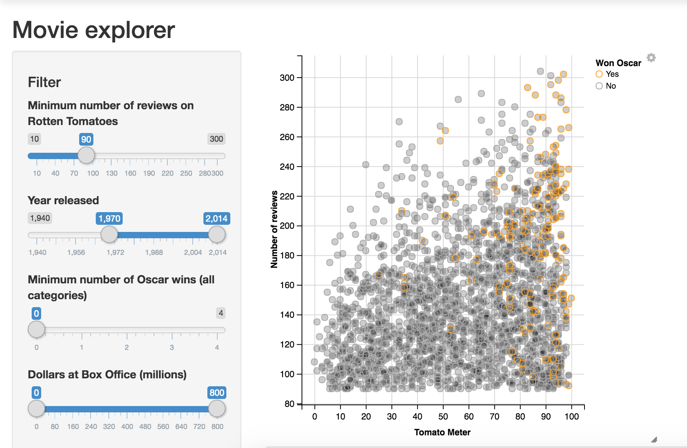

```{r setup, include=FALSE}
knitr::opts_chunk$set(echo = TRUE)
```

### This example shows a nice filter we could alter to use with healthcare data. The user could have the option to select certain aspects of a healthcare plan. The output could be a bell curve showing how likely we believe they are to use the hospital.

https://shiny.rstudio.com/gallery/movie-explorer.html

